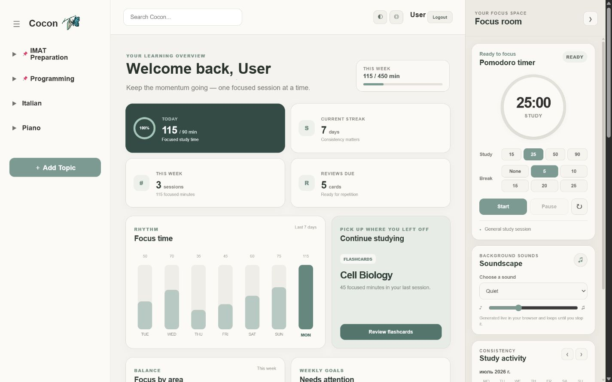
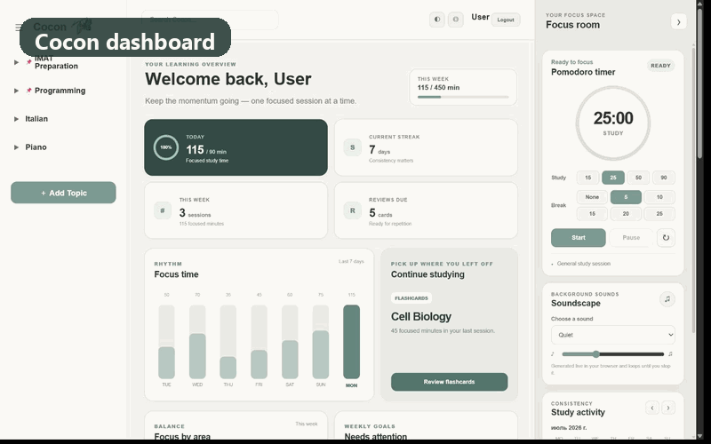

<p align="center">
  
</p>

<h1 align="center">Cocon</h1>

<p align="center">
  A calm, all-in-one study workspace for turning focused time into visible progress.
</p>




Cocon helps organize learning materials, plan the next step, and understand
where focused time actually goes.
Instead of keeping notes, flashcards, timers, and plans across many tabs, Cocon
connects them to one learning hierarchy:

`Topic → Section → Subject → Notes / Flashcards`

## Product tour



The demo uses fictional study data and a neutral user profile; no personal
database or uploaded learning files are included in the repository.

## What it can do

- Organize topics, sections, and subjects, including pinned topics and progress.
- Create rich notes with images and PDF attachments, plus pinned and quick notes.
- Build flashcard decks with images, mastery state, and spaced-review scheduling.
- Run a persistent Pomodoro timer with configurable study and break durations.
- Attribute completed focus sessions to a topic, section, subject, notes, or
  flashcards—even when the timer continues in another browser tab.
- Roll completed sessions up through Topic → Section → Subject → activity,
  with weekly pace warnings for goals that are starting to fall behind.
- Show focus balance, streaks, goals, review backlog, recent activity, and a
  calendar of completed sessions.
- Plan tasks with due dates and priorities.
- Play looping browser-generated soundscapes without external audio files.
- Switch between light, dark, and low-stimulation interfaces.

## Tech stack

- Python 3.12
- Django 6
- SQLite for local development
- Vanilla JavaScript, HTML, and CSS
- Pillow and django-cleanup for uploaded media

## Run locally

1. Clone the repository and enter the project directory.
2. Create and activate a virtual environment.
3. Install dependencies and prepare the database:

```bash
python -m venv .venv
python -m pip install -r requirements.txt
python manage.py migrate
```

4. Start the development server:

```bash
python manage.py runserver
```

5. Open `http://127.0.0.1:8000/` and create an account.

The repository does not include a database or uploaded media. Django creates a
fresh local `db.sqlite3` automatically when migrations run.

## Configuration

Local development works with safe development defaults. For deployment, set
the variables listed in `.env.example` through the hosting platform. At a
minimum, production needs:

```text
DJANGO_SECRET_KEY=<a new long random value>
DJANGO_DEBUG=False
DJANGO_ALLOWED_HOSTS=your-domain.example
DJANGO_CSRF_TRUSTED_ORIGINS=https://your-domain.example
```

The checked-in `.env.example` is documentation only; `.env` files and secrets
are intentionally ignored by Git.

## Tests

Run the complete test suite and project checks with:

```bash
python manage.py check
python manage.py makemigrations --check --dry-run
python manage.py test
```

GitHub Actions runs the same checks for every push and pull request.

## Project structure

```text
config/      Django configuration and root URLs
topics/      Topic, section, subject, dashboard, and search flows
notes/       Contextual notes, attachments, pins, and quick notes
flashcards/  Decks, review scheduling, and mastery state
study/       Focus-session tracking and Pomodoro endpoints
planner/     To-do tasks and deadlines
users/       Registration and study preferences
templates/   Shared and page templates
static/      CSS and browser-side JavaScript
```

## Privacy and repository data

`db.sqlite3`, uploaded files in `media/`, local logs, environment files, and
Python caches are excluded from Git. This keeps personal study data and
copyrighted learning materials out of the public repository.

## License

Released under the [MIT License](LICENSE).
